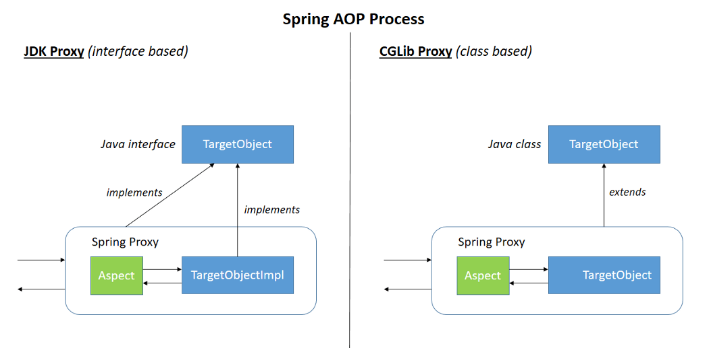

:::tip
记录对代理模式的学习，已经区分静态代理和动态代理。
:::
<!-- more -->

## 代理模式定义  
根据[GoF](https://zh.wikipedia.org/wiki/%E8%AE%BE%E8%AE%A1%E6%A8%A1%E5%BC%8F%EF%BC%9A%E5%8F%AF%E5%A4%8D%E7%94%A8%E9%9D%A2%E5%90%91%E5%AF%B9%E8%B1%A1%E8%BD%AF%E4%BB%B6%E7%9A%84%E5%9F%BA%E7%A1%80)的定义, 代理对象是对另外一个对象的代理或占位，用来实现对其的访问控制。  
### 代理模式的用途  
使用对象作为其他类时，可以使用代理模式。  
用于懒加载资源时，可以使用代理模式。  
或者可以用于额外的安全控制方面。
### 代理模式的实际应用
1.hibernate中代理来自数据库的资源对象。实现懒加载  
2.代理网络对象，实现安全控制。  
3.spring框架中实现AOP编程。  
## 静态代理与动态代理
1.静态代理可以通过使用普通的java类来实现，在编译期就可以确定所有的代理情况。缺点是需要提前编写所有的代理类，把代理关系确定下来，对代码侵入性比较大。其次灵活性不够，还需要维护庞大的代码。  
2.动态代理，可以使用字节码工具来实现，比如javassist，cglib等。限制是类不能是final的，这种方法需要通过继承来实现代理。  
另外一种方法是通过jdk的proxy。通过接口来实现代理。  
  
在使用jdk的proxy机制过程中，主要是实现一个InvocationHandler和使用Proxy.newProxyInstance()生成proxyObject，包装原有的对象。然后在proxyObject上调用的方法。
### 动态代理实现
我们先来了解下java虚拟机的类加载流程，分为五个阶段，加载、验证、准备、解析、初始化。  
【java class加载示意图】  
其中在加载阶段完成了  
1. 对类的读取，通过类的全限定名找到类，获取类的二进制字节流  
2. 将字节流代表的静态存储结构转化为方法区运行时数据结构  
3. 在内存中生成一个代表这个类的```java.lang.class```对象，作为方法区这个类各种数据的访问入口。  
实现思路：  
动态生成代理类字节码，然后加载到jvm中。  
常用的字节码操作类库：  
javassist、CGlib、ASM等。
为了保持代理类与目标对象的一致性，有两种常见的方式：  
1. JDK动态代理，通过实现接口的方式  
2. CGLIB动态代理，通过继承的方式  
【示例代码】  

JDK实现代理：  
优点：解决了静态代理的冗余  
缺点：只能基于接口来使用  
CGlib实现动态代理：  
优点：可以针对接口和类实现代理，灵活方便。采用字节码增强技术，性能不错。  
缺点：技术实现相对难以理解。  
## 参考链接
1. [proxy design pattern](https://howtodoinjava.com/design-patterns/structural/proxy-design-pattern/)  
2. [代理模式|菜鸟教程](https://www.runoob.com/design-pattern/proxy-pattern.html)  
3. [Java 动态代理详解](https://juejin.im/post/6844903744954433544)
4. [bytecode libraries](https://java-source.net/open-source/bytecode-libraries)