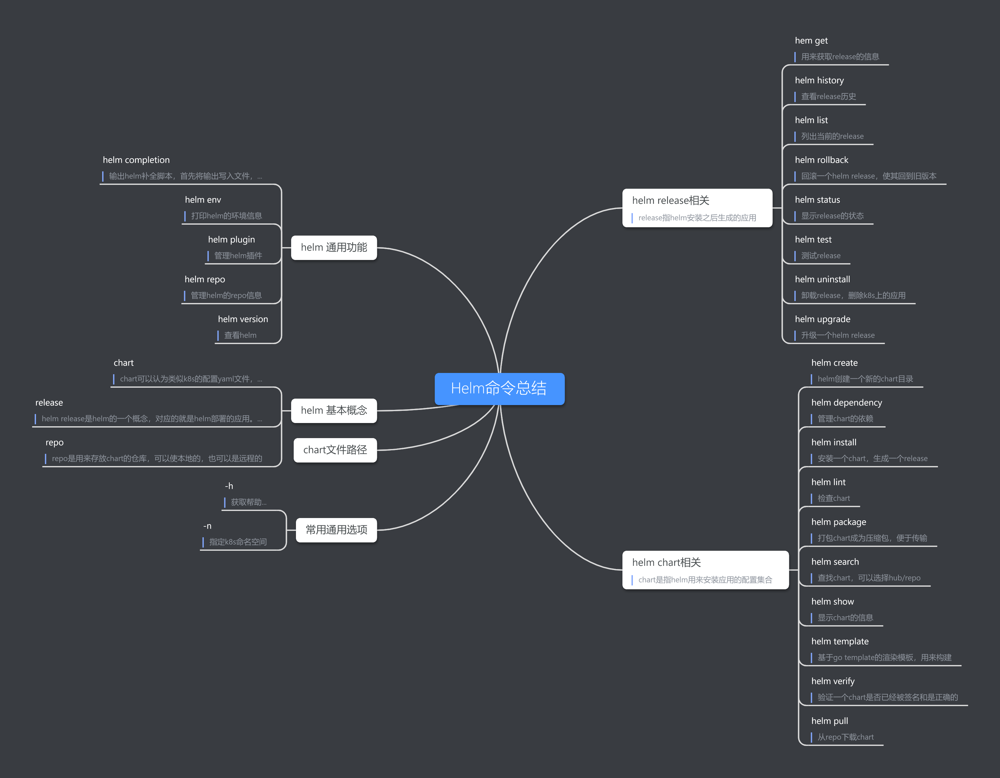

:::tip
关于helm基础信息的介绍
:::
<!-- more -->
<!-- TOC -->

- [helm基础](#helm基础)
- [helm命令](#helm命令)
  - [基础命令](#基础命令)
  - [环境变量](#环境变量)
  - [默认文件夹](#默认文件夹)
- [helm特性](#helm特性)
- [参考](#参考)

<!-- /TOC -->
## helm基础
helm是针对k8s配置提供的打包、分享工具。可以看做k8s下的apt-get、yum。  
helm相关术语：  
* Helm: Kubernetes的应用打包工具，也是命令行工具的名称。
* Tiller: Helm的服务端，部署在Kubernetes集群中，用于处理Helm的相关命令。
* Chart: Helm的打包格式，内部包含了一组相关的kubernetes资源。gzip格式文件。
* Repoistory: Helm的软件仓库，repository本质上是一个web服务器，该服务器保存了chart软件包以供下载，并有提供一个该repository的chart包的清单文件以供查询。在使用时，Helm可以对接多个不同的Repository。
* Release: 使用Helm install命令在Kubernetes集群中安装的Chart称为Release。
* version：helm在部署应用的时候，提出了一个版本的概念，同一个应用，每次对该应用更改就会生成一个新的版本。那么我们就可以方便的对其进行升级和回滚操作了。

## helm命令  
### 基础命令  
* helm search： 查找chart，hub/repo  
* helm install： 安装一个包到k8s，称为一个应用。  
* helm upgrade/rollback: 升级和回滚版本  
* helm uninstall： 卸载一个应用  
* helm completion: 生成补全脚本
* helm create: 在本地创建一个指定名字的chart目录
* helm dependency：管理chart依赖
* helm env： helm客户端环境信息
* helm get：下载针对一个release的额外信息
* helm history：获取release的历史信息
* helm install:安装一个chart
* helm lint：检查chart可能出现的问题
* helm list：列出release
* helm package：打包chart
* helm plugin：管理helm plugin
* helm pull： 下载一个chart到本地
* helm repo：repository相关操作
* helm rollback：回滚一个release到上一个版本（revision）
* helm search：搜索chart
* helm status：显示release的状态
* helm show：显示chart的信息
* helm template：本地渲染模板
* helm test：测试一个release
* helm uninstall：卸载一个release
* helm upgrade：升级release
* helm verify：验证给定路径下的chart是签名过的和正确的
* helm version：打印客户端版本信息  
常见选项：  
    -h 帮助信息  
    -n 名称空间  
    

### 环境变量  

|name|description|
|----|-----------|
|$HELM_CACHE_HOME|缓存文件存储位置|
### 默认文件夹

## helm特性
helm 3实验性质支持OCI，OCI（Open Container Initiatives）

## 参考
1. [helm介绍](https://zhaohuabing.com/2018/04/16/using-helm-to-deploy-to-kubernetes/)