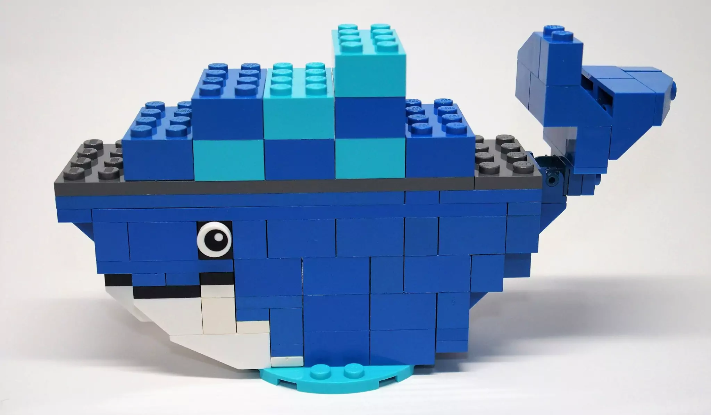
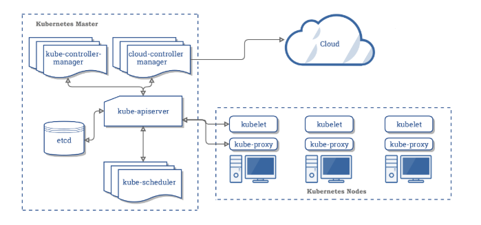
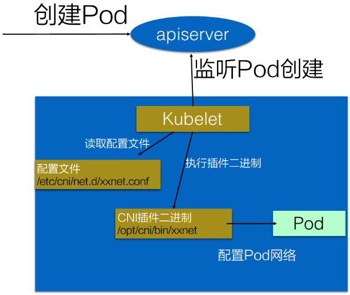
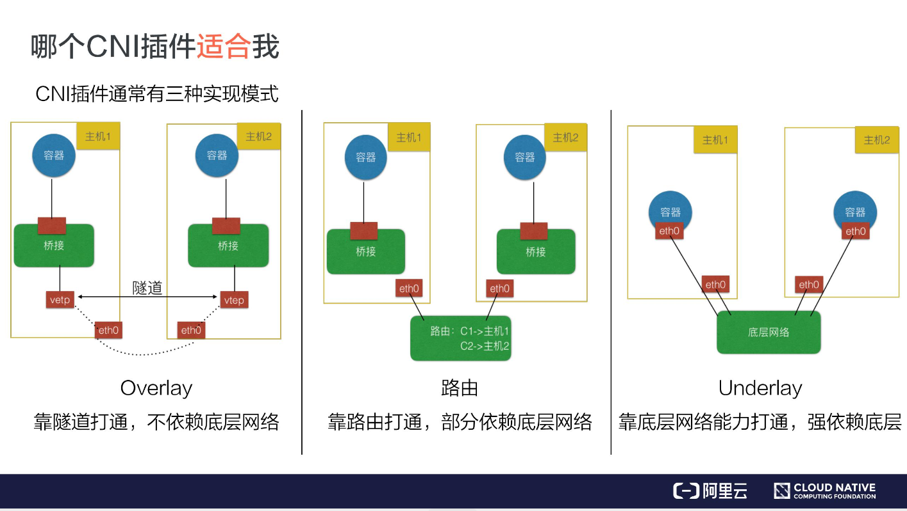

:::tip
关于一些k8s的基础知识介绍
:::
<!-- more -->

<!-- TOC -->

- [k8s基础](#k8s基础)
  - [k8s核心概念](#k8s核心概念)
    - [核心功能](#核心功能)
    - [功能介绍](#功能介绍)
  - [k8s主要架构](#k8s主要架构)
    - [k8s master架构](#k8s-master架构)
    - [k8s架构](#k8s架构)
  - [k8s容器概念](#k8s容器概念)
    - [进程管理](#进程管理)
    - [容器概念](#容器概念)
    - [镜像](#镜像)
    - [容器的生命周期](#容器的生命周期)
  - [k8s CRI(Container Runtime Interface)](#k8s-cricontainer-runtime-interface)
  - [pod概念](#pod概念)
  - [pod网络模型](#pod网络模型)
  - [kube-proxy代理模式](#kube-proxy代理模式)
    - [userspace代理模式](#userspace代理模式)
    - [iptables代理模式](#iptables代理模式)
    - [IPVS模式](#ipvs模式)
  - [k8s deployment](#k8s-deployment)
  - [k8s services(发布服务的类型)](#k8s-services发布服务的类型)
    - [clusterIP](#clusterip)
    - [NodePort](#nodeport)
    - [LoadBalancer](#loadbalancer)
    - [ExternalName](#externalname)
  - [helm](#helm)
  - [k8s CNI(Container Network Interface)](#k8s-cnicontainer-network-interface)
    - [k8s如何调用CNI](#k8s如何调用cni)
    - [CNI插件](#cni插件)
  - [k8s创建工具---kubeadm](#k8s创建工具---kubeadm)
  - [service account](#service-account)
    - [service account admission controller](#service-account-admission-controller)
    - [Token controller](#token-controller)
    - [Service Account Controller](#service-account-controller)
  - [k8s日志架构](#k8s日志架构)
    - [节点级日志架构](#节点级日志架构)
      - [容器日志](#容器日志)
      - [系统组件日志](#系统组件日志)
    - [集群级日志架构](#集群级日志架构)
- [ref参考链接](#ref参考链接)

<!-- /TOC -->
## k8s基础
### k8s核心概念
k8s是一个自动化的容器编排平台。
#### 核心功能
* 服务的发现与均衡
* 容器的自动装箱（或者叫scheduling），将容器与存储连接
* 服务的自动恢复
* 服务的自动发现与回滚
* 执行job
* 弹性伸缩
#### 功能介绍
* 调度  
观察容器的大小、规格，调度到空闲的机器。
* 自愈
节点健康检查，容器的自动迁移，实现集群内容器的自恢复。
* 水平伸缩  
自动化扩展，自动控制应用副本数
### k8s主要架构
k8s架构是一个典型的二层架构和server-client架构。  
用户侧的所有请求都只会与master交互，由master下发给node节点。  
#### k8s master架构

k8s的master主要包含四个组件：  
* API server
k8s所有组件都会和API server连接，而不会组件间独立连接。本身可以水平扩展。  
* controller
对集群状态进行管理，执行容器的修复、扩展等
* Scheduler
调度器，进行容器的调度管理
* etcd
分布式存储系统，本身为高可用组件，保证整个系统的高可用。  
#### k8s架构

* node 运行负载的主机
* pod，运行pod的组件为kubelet。k8s不直接操作网络存储，而是通过插件来完成，比如storage plugin或者network plugin。  
最小的一个调度单元，有一个或多个容器组成，定义容器的运行方式，提供容器共享的运行环境。
* kube-proxy，利用iptable的能力组件k8s的network。  
**k8s内部抽象概念**  
* volume，用来管理容器的存储，本身为一个抽象概念，支持多种后端存储。支持本地存储，支持分布式存储，像ceph，GlusterFS等，或者云盘等。
* deployment，定义pod的副本数，pod的版本等，通过控制器控制pod的数目，以及pod的版本控制策略等，滚动升级、回滚等。  
* service，提供一个多个pod实例的稳定访问地址。支持clusterIP，也支持nodePort、LoadBalancer等。  
* namespace，集群内部逻辑隔离。
### k8s容器概念
#### 进程管理
操作系统管理进程：  
1. 进程可以相互看到，相互通信。
2. 使用同一个文件系统，可以对同一个文件进行读写操作
3. 进程会使用相同的系统资源
这些特点带来的问题：  
* 进程可以相互看到且通信，高权限的进程可以攻击其他进程
* 同一时间操作文件会导致冲突和错误
* 应用之间资源抢占，导致应用无法正常提供服务。  
针对上述的上个问题，如何提供独立的运行环境：  
* 通过chroot系统调用将子目录变成根目录，达到视图级别的隔离。进程在chroot的帮助下可以具有独立的文件系统，对于这样的文件系统进行增删改查不会影响到其他进程。  
* 通过namespace技术实现进程在资源的视图上进行隔离。  
* 通过Cgroup来限制资源使用率，设置其能够使用的CPU以及内存量。  
#### 容器概念
其实容器就是这样一个视图隔离、资源可限制、独立文件系统的进程集合。  
容器具有一个独立的文件系统，使用系统的资源，所以独立文件系统内不需要具备内核相关代码或者工具。只需要提供容器所需的二进制文件、配置文件及依赖即可。  
#### 镜像
Dockfile描述了构建镜像的每个步骤，每个步骤描述了我们对文件进行的操作，文件所发生的变化集合被称为changeset。  

changeset可以进行分层和复用，从而提高了效率，节省了空间：  
1. 提高分发效率，下载镜像时，只需要下载本地没有change。  
2. 数据共享，节省了本地的存储空间。
#### 容器的生命周期
docker run的时候会选择一个镜像来提供独立的文件系统并制定相应的运行程序。这里的程序称为initial进程，其启动时容器随之启动，其退出时，容器结束。  
### k8s CRI(Container Runtime Interface)
CRI为容器的运行时，CRI的通信协议为gRPC。负责处理镜像管理、容器生命周期管理、容器接口（exec，log，attach，ports）等。  
CRI描述了kubelet期望的容器运行时行为。  
CRI stream接口用来在容器内部执行一个命令。  
CRI的实现有docker-shim（垫片程序）、containerd、CRI-O、Rocket、Frakti等。  
额外介绍：  
docker-containerd：高性能容器运行时，管控容器的daemon  
docker-runc：运行容器的命令工具  
docker-container-shim：垫片程序，将containerd和真实的容器进程解耦。
docker-init：容器内的1号进程，作为其他进程的父进程。
docker-proxy：网络代理，底层使用iptables实现。
### pod概念
pod的可以理解为多个linux命名空间的联合
* pid命名空间（同一个pod中进程可以互相看到）
* 网络命名空间（同一个pod的应用对相同的ip和端口有权限）
* IPC命名空间（同一个pod中的应用可以通过VPC或者POSIX进行通信）
* UTS命名空间（同一个pod中的应用共享一个主机名称）
### pod网络模型
### kube-proxy代理模式
#### userspace代理模式
这种模式，kube-proxy 会监视 Kubernetes 主控节点对 Service 对象和 Endpoints 对象的添加和移除操作。 对每个 Service，它会在本地 Node 上打开一个端口（随机选择）。 任何连接到“代理端口”的请求，都会被代理到 Service 的后端 Pods 中的某个上面（如 Endpoints 所报告的一样）。 使用哪个后端 Pod，是 kube-proxy 基于 SessionAffinity 来确定的。  
最后，它配置 iptables 规则，捕获到达该 Service 的 clusterIP（是虚拟 IP） 和 Port 的请求，并重定向到代理端口，代理端口再代理请求到后端Pod。  
默认情况下，用户空间模式下的 kube-proxy 通过轮转算法选择后端。
#### iptables代理模式
这种模式，kube-proxy 会监视 Kubernetes 控制节点对 Service 对象和 Endpoints 对象的添加和移除。 对每个 Service，它会配置 iptables 规则，从而捕获到达该 Service 的 clusterIP 和端口的请求，进而将请求重定向到 Service 的一组后端中的某个 Pod 上面。 对于每个 Endpoints 对象，它也会配置 iptables 规则，这个规则会选择一个后端组合。

默认的策略是，kube-proxy 在 iptables 模式下随机选择一个后端。

使用 iptables 处理流量具有较低的系统开销，因为流量由 Linux netfilter 处理， 而无需在用户空间和内核空间之间切换。 这种方法也可能更可靠。

如果 kube-proxy 在 iptables 模式下运行，并且所选的第一个 Pod 没有响应， 则连接失败。 这与用户空间模式不同：在这种情况下，kube-proxy 将检测到与第一个 Pod 的连接已失败， 并会自动使用其他后端 Pod 重试。

你可以使用 Pod 就绪探测器 验证后端 Pod 可以正常工作，以便 iptables 模式下的 kube-proxy 仅看到测试正常的后端。 这样做意味着你避免将流量通过 kube-proxy 发送到已知已失败的 Pod。
#### IPVS模式
在 ipvs 模式下，kube-proxy监视Kubernetes服务和端点，调用 netlink 接口相应地创建 IPVS 规则， 并定期将 IPVS 规则与 Kubernetes 服务和端点同步。 该控制循环可确保IPVS 状态与所需状态匹配。访问服务时，IPVS 将流量定向到后端Pod之一。

IPVS代理模式基于类似于 iptables 模式的 netfilter 挂钩函数， 但是使用哈希表作为基础数据结构，并且在内核空间中工作。 这意味着，与 iptables 模式下的 kube-proxy 相比，IPVS 模式下的 kube-proxy 重定向通信的延迟要短，并且在同步代理规则时具有更好的性能。 与其他代理模式相比，IPVS 模式还支持更高的网络流量吞吐量。
### k8s deployment
### k8s services(发布服务的类型)
#### clusterIP
通过集群内部IP（VIP）暴露服务，该服务只能集群内访问。
#### NodePort
通过节点IP及静态端口暴露服务，会路由到自动创建的ClusterIP服务。
#### LoadBalancer
使用负载均衡器对外暴露服务。
#### ExternalName
通过返回CNAM和对应值，将服务映射到externalname字段的内容。
### helm
### k8s CNI(Container Network Interface)
k8s标准中一个调用网络实现的接口。用来调用CNI插件，比如Calico，Flannel, Teway, Weave Net以及Contiv。  

#### k8s如何调用CNI
基本使用方法：  
1. 首先在每个结点上配置CNI配置文件(/etc/cni/net.d/xxnet.conf)  
2. 安装CNI配置文件中多对应的二进制插件
3. 创建pod之后，kubelet就会根据CNI配置文件执行前两步所安装的CNI插件。
4. CNI插件进入pod的空间配置pod的网络。
#### CNI插件

实现方式：  
通常来说CNI插件可以分为三种：  
Overlay、路由及Underlay。  
* Overlay模式：  
独立于主机的ip段，通过在主机之间建立隧道，好处不依赖底层网络，但是性能有损失。
* 路由模式：  
跨主机通信靠路由打通，但是需要依赖底层网络。  
* underlay模式：  
容器和宿主机在同一个网络，打通需要依赖底层网络。  
许多underlay的插件不支持k8s的service服务发现。
### k8s创建工具---kubeadm
### service account
user accounts（普通账户）和service account（服务账号）的区别：  
* 普通账户是针对个人用户的，服务账号是针对pod进程的
* 普通账户是全局性的，在集群所有namespace中名称唯一
* 服务账户相对普通账户更加轻量化，可以为特定任务创建服务账户。  
* 复杂系统的配置包，可以包括对该系统各个组件的服务账户的定义  
有三个不同的组件协作，来实现service account的自动化。
* service account准入器（admission controller）
* Token controller
* service account controller
#### service account admission controller
admission controller插件用来对pod进行修改，是apiserver的一部分。主要作用：  
1. 为pod设置service account
2. 为pod提供ImagePullSecrets
3. 为包含API访问的token的pod添加一个volume。把volumeSource添加到安装在pod的每个容器中，挂载在/var/run/secrets/kubernetes.io/serviceaccount  
#### Token controller
Token controller作为controller的一部分运行。异步行为：  
* 观察serviceAccount的创建，并创建一个相应的Secret来允许API的访问
* 观察serviceAccount的删除，并删除相应的serviceAccount Token Secret。
* 观察secret添加，并确保关联的ServiceAccount存在，并在需要时向secret中添加一个token。
* 观察secret删除，并在需要时对应ServiceAccount的关联。  
#### Service Account Controller
其在namspaces中管理service account，并确保每个有效的namespaces中都有一个defaul的serviceAccount。  
### k8s日志架构
Kubernetes 没有为日志数据提供原生存储方案，但是你可以集成许多现有的日志解决方案到 Kubernetes 集群中。  
#### 节点级日志架构
##### 容器日志
容器化应用写入stdout和stderr的任何数据都会被容器引擎捕获并重定向到某个位置。  
##### 系统组件日志
系统组件有两种类型：在容器中运行的和不在容器中运行的。例如：  
* 在容器中运行的 kube-scheduler 和 kube-proxy。
* 不在容器中运行的 kubelet 和容器运行时（例如 Docker）。  

在使用 systemd 机制的服务器上，kubelet 和容器 runtime 写入日志到 journald。 如果没有 systemd，他们写入日志到 /var/log 目录的 .log 文件。 容器中的系统组件通常将日志写到 /var/log 目录，绕过了默认的日志机制。他们使用 klog 日志库。 你可以在日志开发文档找到这些组件的日志告警级别协议。  
#### 集群级日志架构
一般有以下几个选项：  
* 使用在每个节点上运行的节点级日志记录代理
* 在应用程序的pod中，包含专门记录日志的sidecar容器
* 将日志直接从应用程序中推送到日志记录的后端

## ref参考链接
1. [infoQ CRI介绍](https://www.infoq.cn/article/EAH8zM3VH8MgwOt5Hokc)
2. [docker基本概念介绍](https://jiajunhuang.com/articles/2018_12_24-docker_components_part2.md.html)
3. [从零开始入门 K8s](https://www.infoq.cn/article/te70FlSyxhltL1Cr7gzM)
4. [Kubernetes必备知识： pod网络模型](https://developer.aliyun.com/article/745468)
5. [pod概念介绍](https://www.kubernetes.org.cn/kubernetes-pod)
6. [k8s日志架构](https://kubernetes.io/zh/docs/concepts/cluster-administration/logging/)