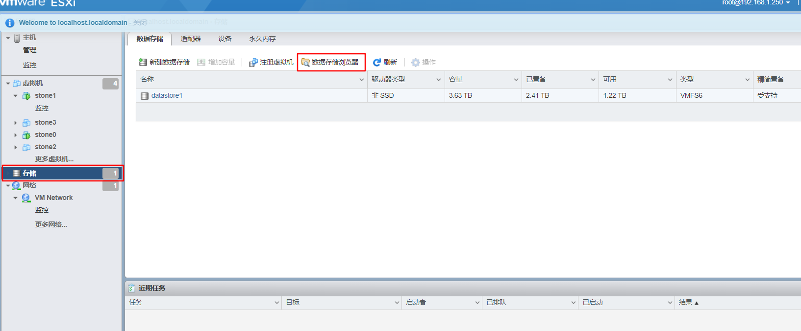
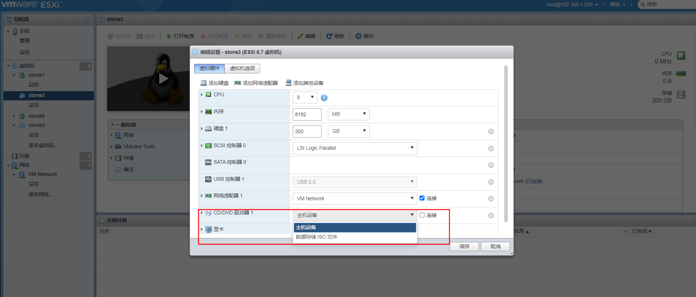

:::tip
记录给物理服务器安装系统的过程
:::
<!-- more -->

## 准备个人私有物理服务器

### 安装操作系统
安装esxi操作系统：  
我安装的是esxi  
1. 下载esxi镜像  
可以搜索esxi或者在戴尔官网找相应的服务器型号，找到对应的esxi型号。  
我下载了esxi6.7的镜像。  
2. 制作镜像安装盘  
可以**Rufus**使用镜像安装u盘。  
3. 在服务器上连接键盘，显示器和U盘  
在BIOS的引导选项里面将引导第一位选择为u盘。  
如果出现提示“menu.c32 not a com32r image”，无法继续安装。可以按TAB键，然后按照提示输入命令就可以继续安装了。  
然后重新启动，按照步骤安装，设置root密码，这个密码可以用于直接在服务器上修改配置，也可以用于ssh登陆esxi系统，或者登陆web管理界面。  
4. 安装完成后，修改网络配置  
为了方便管理，设置网络地址为内网的固定ip，注意这里要让网络配置生效必须要restart manage network。  
### web管理界面
web管理界面可以通过esxi配置的固定ip来访问。  
登陆用户为root，密码为安装时设置的密码。  
我们这时候就可以把服务器放到一边，后续的管理可以都通过web管理页面来操作。  
### 安装虚拟机
1. 准备虚拟机操作系统文件  
下载虚拟机文件，通过web管理界面上传到存储目录。  
存储->数据存储->数据存储浏览

2. 创建虚拟机  
通过web管理界面创建虚拟机。  
3. 为虚拟机提供外挂操作系统镜像为光盘驱动器  
虚拟机->虚拟机名字->编辑->CD/VCD驱动器，里面选择数据存储ISO文件。  

4. 安装操作系统  

注意：服务器的内存和CPU都是动态占用的，但是硬盘是固定分配的。  
那么硬盘大小只能扩大不能缩小，后续扩展的硬盘要自己格式化，然后挂载到虚拟机系统里面。
### 虚拟机直通USB移动硬盘  
直接在虚拟机编辑里面增加一个USB设备即可。  
### 服务器管理
戴尔服务器支持可以通过网线直连的iDRAC方式管理。
### 开始探索  
好了，从现在开始你就可以直接使用虚拟机来干你想做的事了。  

