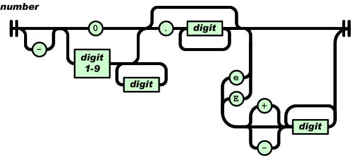

## 如何写一个json解析库
<!-- TOC -->

- [如何写一个json解析库](#如何写一个json解析库)
  - [1. 准备环境](#1-准备环境)
  - [2. 辅助类准备](#2-辅助类准备)
  - [3. API设计](#3-api设计)
  - [4. JSON语法子集](#4-json语法子集)
  - [ref](#ref)

<!-- /TOC -->

### 1. 准备环境  
   idea+testng
### 2. 辅助类准备  
  准备数据类型enum和json数据结构  
  json数据拥有以下几种类型：  
  ```
    NULL,
    FALSE,
    TRUE,
    NUMBER,
    STRING,
    ARRAY,
    OBJECT
  ```
  Json的一个节点可以用如下表示：  
  ```
  public class JsonNode {
    DataType type;

    public DataType getType() {
        return type;
    }

    public void setType(DataType type) {
        this.type = type;
    }
}
  ```
### 3. API设计  
  我们的供外部调用的API有两个：  
  ```
  public interface AsJson {
    /**
     * @param jsonNode root json node
     * @param jsonStr json string to be parsed
     * @return result code
     */
    int parse(JsonNode jsonNode, final String jsonStr);

    /**
     * @param jsonNode json data node
     * @return the data type of this node
     */
    DataType get_type(final JsonNode jsonNode);
}
  ```
### 4. JSON语法子集  
  #### 第一步：解析含有null/false/true的字符串  
  使用RFC7159的ABNF表示：  
  ```
  JSON-text = ws value ws
ws = *(%x20 / %x09 / %x0A / %x0D)
value = null / false / true 
null  = "null"
false = "false"
true  = "true"
  ```

  JSON文本由三部分组成，空白（ws），一个值，加一个空白（ws）。  
  第二行表示空白可以为（多个空格，制表符、换行符、回车符）  
  现有值只有null或false或true  
  先根据标准，编写测试用例，再编写代码。

  #### 第二步：支持数字类型  
  语法：  
  ```
  number = [ "-" ] int [ frac ] [ exp ]
int = "0" / digit1-9 *digit
frac = "." 1*digit
exp = ("e" / "E") ["-" / "+"] 1*digit
  ```
  JSON 标准 ECMA-404 采用图的形式表示语法，也可以更直观地看到解析时可能经过的路径：  
    
  使用双精度浮点数来存储数字。  

  #### 第三步：支持字符串解析
  语法：
  ```
  string = quotation-mark *char quotation-mark
char = unescaped /
   escape (
       %x22 /          ; "    quotation mark  U+0022
       %x5C /          ; \    reverse solidus U+005C
       %x2F /          ; /    solidus         U+002F
       %x62 /          ; b    backspace       U+0008
       %x66 /          ; f    form feed       U+000C
       %x6E /          ; n    line feed       U+000A
       %x72 /          ; r    carriage return U+000D
       %x74 /          ; t    tab             U+0009
       %x75 4HEXDIG )  ; uXXXX                U+XXXX
escape = %x5C          ; \
quotation-mark = %x22  ; "
unescaped = %x20-21 / %x23-5B / %x5D-10FFFF
  ```  

  #### 第四步：支持Unicode解析  
  这些字符被收录为统一字符集（Universal Coded Character Set, UCS），每个字符映射至一个整数码点（code point），码点的范围是 0 至 0x10FFFF，码点又通常记作 U+XXXX，当中 XXXX 为 16 进位数字。  
  因此，Unicode 还制定了各种储存码点的方式，这些方式称为 Unicode 转换格式（Uniform Transformation Format, UTF）。现时流行的 UTF 为 UTF-8、UTF-16 和 UTF-32。每种 UTF 会把一个码点储存为一至多个编码单元（code unit）。例如 UTF-8 的编码单元是 8 位的字节、UTF-16 为 16 位、UTF-32 为 32 位。除 UTF-32 外，UTF-8 和 UTF-16 都是可变长度编码。  
  我们的JSON库只支持UTF-8.

  第四步：支持数组
  数组的语法：
  ```
  array = %x5B ws [ value *( ws %x2C ws value ) ] ws %x5D
  ```
  %x5B为\[, %x5D为\]  
  重难点在于内存管理：  
  1. 使用链表来存储数组结构  
  2. 递归解析数组单个数据  
   
  #### 第五步： 解析对象
  可以使用动态数组，有序动态数组，平衡树，哈希表。  
  JSON 对象以花括号 {}（U+007B、U+007D）包裹表示，另外 JSON 对象由对象成员（member）组成，而 JSON 数组由 JSON 值组成。所谓对象成员，就是键值对，键必须为 JSON 字符串，然后值是任何 JSON 值，中间以冒号 :（U+003A）分隔。完整语法如下：
  ```
  member = string ws %x3A ws value
object = %x7B ws [ member *( ws %x2C ws member ) ] ws %x7D
  ```
  对象解析与数组解析类似，不同之处只是需要解析key和value两类值。  
  解析key可以复用之前的解析  

  #### 第六步：生成器  
  生成器就是将解析成jsonNode的json数据重新生成为字符串的过程。  
  这个过程比较简单，一般不会出现错误。  
  ### 额外功能  
  1. 对象键值查询  
  2. 相等比较  
  3. 复制、移动、交换  
  
### ref
1. [从零开始的 JSON 库教程](https://zhuanlan.zhihu.com/p/22460835)
2. [ABNF 表示](https://tools.ietf.org/html/rfc5234)