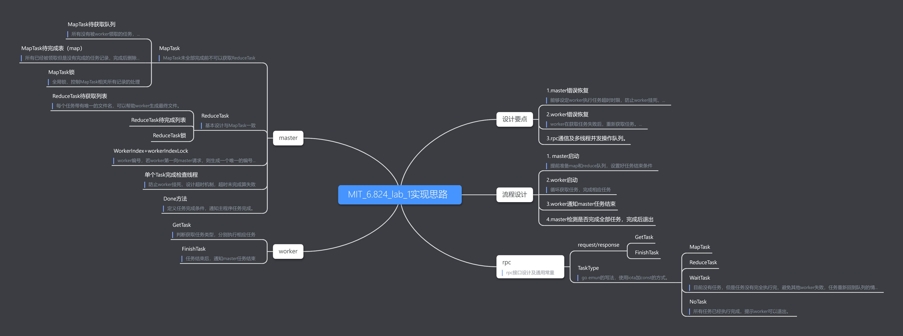

:::tip
MIT6.824课程学习记录，第二部分MapReduce学习
:::
<!-- more -->
## 概览
长时间的在TB级别数据上的计算。  
如 创建索引、排序、分析web结构  
## lab-mr map reduce实验
### 实验主要实现

### 需要了解的golang基础
* golang基础包
```
import (
	"fmt"
	"hash/fnv"
	"io/ioutil"
	"log"
	"net/rpc"
	"os"
	"sort"
	"strconv"
	"strings"
	"time"
)
import (
	"container/list"
	"log"
	"math"
	"net"
	"net/http"
	"net/rpc"
	"os"
	"strconv"
	"sync"
	"time"
)
```
* go class类相关知识  
go struct来代替class  
golang的函数定义形式：```func (m *Master) getReduceTask(workerName string) (string, string```  
变量定义形式：```var filename string```  
golang没有隐式的构造函数，需要专门编写构造函数,如New()来初始化其属性值，或者使用内联的初始化函数。  
内联初始化：
```
objectA:=classA{
  atrr1: 1,
  attr2: 2,
}
```  
* go数组及集合相关知识
list的相关方法  
```
list.New()
PushFront()  
PushBack()  
Len()  
Front()  
Element.Next()  
Remove()  
Element.Value 返回的是interface{}类型，需要进行转换。  
array数组相关方法  
初始化数组， make(int[], size)  
```
* go锁相关知识  
```
定义锁 reduceTaskLock sync.Mutex
Lock()  
Unlock()  
defer的用法,在函数结束时执行,谨慎使用，可能会导致锁的范围扩大，性能下降  
```
* go文件读写  
```
os.Create(file_name)  
os.Open(file_name)  
ioutil.ReadAll(file_pointer)  
fmt.Fprintf(file_pointer,fomart_string, value...)  
```
* go 基本数据类型  
```
int
string
map[string]string
container/list
```
* go的log机制  
```
log.Printf()
log.Print()
```
* go的rpc机制  
启动server
```
func (m *Master) server() {
	rpc.Register(m)
	rpc.HandleHTTP()
	sockname := masterSock() //get socket name
	os.Remove(sockname)
	l, e := net.Listen("unix", sockname)
	if e != nil {
		log.Fatal("listen error:", e)
	}
	go http.Serve(l, nil)
}
```
```
func call(rpcname string, args interface{}, reply interface{}) bool {
	sockname := masterSock()
	c, err := rpc.DialHTTP("unix", sockname)
	if err != nil {
		log.Fatal("dialing:", err)
	}
	defer c.Close()

	err = c.Call(rpcname, args, reply)
	if err == nil {
		return true
	}

	fmt.Println(err)
	return false
}
```
* etc...  